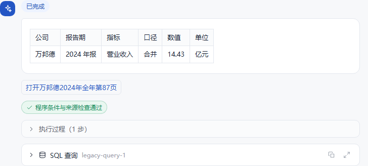
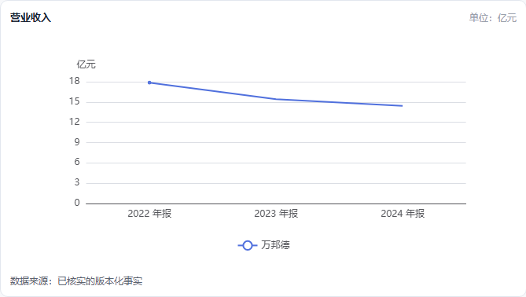

# FinSight财报证据助手

算法主题赛（AI开源）技术报告

参赛方向：开源赋能的AI应用创新

团队名称：凌云队　团队编号：________

| 成员 | 实际分工 |
|---|---|
| 黄俊仪 | 主要完成项目检测报告 |
| 麦明政 | 完成代码实现和代码审核 |

成果仓库：https://github.com/mzmai0658-source/FinSight

报告日期：2026-10-02。本报告对应真实财报200轮工程验收。本阶段未开展演示视频、真实用户试用和答辩PPT。本轮公开交付范围为代码、技术报告、题库和测试摘要；117份真实财报原件及整批来源资产不在此次提交范围。

摘要：FinSight面向财报学习、研究和原文核对，把自然语言问题转换为可追踪的任务要求，由本地开源模型理解公司、指标、期间和对话修改，再由只读查询与Decimal程序执行财务计算、生成图表、定位PDF原页并核验输出。系统采用Python、LangGraph、Java、Vue和Ollama，不训练或微调问答模型。数据来自10家上市公司的117份真实报告，金额、口径、版本和原文证据分别保存，缺失不补零。正式评测包含120道独立问题和20组四轮对话，使用实际登录后的Java/SSE入口及真实保存状态；固定题库重跑属于回归验收，不称全新盲测。成绩、剩余限制和复核方法见实验章节。

## 1. 应用问题、需求和实现目标

### 1.1 读财报时最容易发生的错误

财报查询并不是找到一个同名字段就结束。读者说“净利润”，可能是合并利润表的净利润，也可能关心归属于上市公司股东的净利润。母公司利润表反映母公司单体经营，归母指标则来自合并成果的股东归属。两者都含“母公司”三个字，却不能互换。类似地，营业收入、营业总收入和主营业务收入并非同一指标；半年和前三季度是累计期间，不能冒充单个季度。

这些区别在连续追问中会进一步放大。例如先要求“2023年合并营收、万元、只给表格”，随后说“不是盘龙，是同仁堂”，本轮应该只换公司。如果模型重新猜一遍整个问题，年份可能丢失，单位可能变回默认值，表格也可能变成长段解释。模型即使给出数据库里确实存在的数字，仍可能没有完成用户原来的要求。

另一个问题是证据不对题。某段文字确实来自这家公司的年报，并不能证明它解释了本期营收下降。原始表格用元，回答用亿元，也不能把换算后的句子放进引号，声称是报告原文。FinSight因此分别检查数字一致性、请求满足度和证据支持度，不把“有一个真实出处”等同整个回答正确。

### 1.2 需求优先级和服务边界

| 优先级 | 用户需求 | 本作品采取的处理 |
|---|---|---|
| 首要 | 数字、单位与口径正确 | 明确指标身份，保留十进制精度，查询已验收事实 |
| 首要 | 连续修改条件不丢失 | 版本化状态与字段级操作，记录修改依据 |
| 首要 | 能回到原始财报 | 文件内容摘要、物理页、原始行列和原始单位绑定 |
| 其次 | 比较、排名和图表 | 程序计算与排序，图表点引用事实，缺失保持空值 |
| 其次 | 解释概念与经营原因 | 固定财务定义与对应期间叙述证据，缺证据时说明 |
| 配套 | 刷新恢复与停止生成 | 固定任务ID、持久任务记录、取消和终态保存 |

目标用户是需要学习、比较和核对上市公司财报的读者。本作品提供披露数据查询和解释，不提供买卖建议，不推断未披露经营事实。覆盖范围固定为现有10家公司，支持年报、半年报、一季度及前三季度累计口径。单季拆分、全市场覆盖和模型微调不属于当前已完成能力。缺公司且上下文不明确时询问，缺年份默认最新年报，泛称净利润默认归母并写明。

本阶段没有真实用户试用，因此不宣称节省阅读时间、改善学习效果或提高满意度。可验证成果是固定工程题库中的完成率、财务原件核对、真实接口运行和软件测试，而不是虚构的用户反馈。

## 2. 总体架构和模型分工

### 2.1 服务组成和一次回答的流程

Vue负责登录、会话、进度、表格、图表、证据详情和原页查看。Java负责身份验证、会话归属、任务登记、SSE事件转发、结果保存及恢复接口。Python使用LangGraph组织理解、状态更新、执行、取证、核验和输出，连接本地Ollama、MySQL规范事实及BGE/Chroma叙述索引。财务执行使用独立只读账号；ETL与数据发布使用不同权限。

<!-- architecture -->

一次普通查数先经过模型的紧凑结构化提案：任务目标是什么、本轮修改哪些条件、引用哪个上下文、哪些事项需要澄清。程序将提案编译为v3请求，检查公司和指标目录、时间选择、单位适用性以及明确限制。随后参数化读取事实，计算与展示，核对来源和要求，最后保存任务结果。最终财务正文不是由模型自由填写数字。

普通查数通常只需要一次模型理解调用；格式或条件失败可以进行有界修正。经营原因解释需要理解、组织结论和核对证据，调用更多、失败风险也更高。每轮最多6次模型调用，单次最长60秒，仍受整轮截止时间约束。Python执行最多240秒，整轮默认270秒，并为保存预留时间。后台标题等调用也进入统一调度，不应绕过模型资源限制。

### 2.2 为什么减少同模型反复审核

小型本地模型能够处理常见问句，但多次问它“刚才是否理解正确”，不能得到真正独立的判断。理解错误可能在后续自评中重复出现，还会消耗更多上下文和等待时间。FinSight把可精确判断的部分交给程序：代码是否登记、指标是否支持、单位是否匹配、条件操作是否合法、执行结果是否覆盖要求。复杂叙述仍需要证据审核，审核可能出错，因此在验收中继续进行原文复核。

模型输出结构受类型约束，但类型合法不等于含义正确。一个合法的公司列表仍可能选错公司，一个合法的报告期仍可能误解用户。所以程序保存本轮原话、修改依据、理解诊断和实际执行条件，遇到未满足要求时阻断或如实标记未完成。缓存只能减少重复准备，不能绕过同一套条件与来源检查。

| 环节 | 本地模型负责 | 程序负责 |
|---|---|---|
| 听懂要求 | 意图、条件修改、上下文引用提案 | 登记值、操作、明确冲突和格式检查 |
| 查询与计算 | 不直接生成财务结果 | 只读SQL、期间选择、Decimal计算 |
| 图表与表格 | 提案中保留展示要求 | 点值、空值、排序、单位和舍入 |
| 经营解释 | 基于给定片段组织语言 | 文件/期间过滤、引用身份和数量限制 |
| 完成与保存 | 不自填“全部完成” | 实际目标状态、分项核验、终态保存 |

### 2.3 自研边界和已有方法的借鉴

FinSight自研部分是统一请求与状态协议、条件编译、财务身份模型、确定性执行、来源绑定、分项核验、任务恢复和验收工具。LangGraph的图调度、Ollama的模型服务、Qwen权重、MySQL、Chroma、BGE及Vue等均属于第三方资源，不列为原创算法。本作品没有训练新的金融模型，也不把通用框架包装成自研模型。

FinGLM的公开方案将财务问答与结构化数据处理结合，启发本作品减少让模型承担精确查数。TAT-LLM强调表格与文本中的金融数值推理，本作品借鉴“理解与计算分离”的工程方向，由程序完成算术，并非复现其训练方法。ConvFinQA提供连续金融问答任务，启发对逐轮上下文和事实引用进行独立测试。本作品不直接声称优于这些项目：数据、模型和评测条件不同，没有同条件对照实验。

可核查参考：[FinGLM](https://github.com/MetaGLM/FinGLM)、[TAT-LLM](https://github.com/fengbinzhu/TAT-LLM)、[ConvFinQA](https://github.com/czyssrs/ConvFinQA)。采用资源的实际版本、来源、许可和义务见第三方资源附件。

## 3. 真实财报数据、指标与证据建模

### 3.1 原件范围与缺失的含义

本轮全部使用本机已有真实报告，覆盖万邦德、信邦制药、葵花药业、凯莱英、盘龙药业、金花股份、同仁堂、太极集团、太龙药业和中恒集团。报告按公司代码、年度和报告期登记，并核对PDF内容摘要及文件身份。报告文件名只是定位信息，内容哈希才是文件版本身份，换路径不会生成新的财务内容。

| 公司 | 年报 | 半年报 | 一季度累计 | 前三季度累计 |
|---|---:|---:|---:|---:|
| 万邦德 | 3 | 3 | 3 | 3 |
| 信邦制药 | 3 | 3 | 3 | 3 |
| 葵花药业 | 3 | 3 | 3 | 3 |
| 凯莱英 | 2 | 3 | 3 | 3 |
| 盘龙药业 | 3 | 3 | 3 | 3 |
| 金花股份 | 3 | 3 | 3 | 3 |
| 同仁堂 | 3 | 2 | 3 | 3 |
| 太极集团 | 3 | 3 | 3 | 3 |
| 太龙药业 | 3 | 3 | 3 | 2 |
| 中恒集团 | 3 | 3 | 3 | 3 |

117份报告不等于10家公司每个年份每种报告都齐全。比如凯莱英当前缺2024年年报，因此“各自最新”与“共同最新”可能选取不同年份。查询缺失报告时不拿邻近年份补齐；缺失指标不补零。`not_found`表示当前提取和核验未取得该项，不能直接推断报告没有披露；`not_disclosed`须有相应原件依据。未完成核实的内容继续排除在可发布事实之外。

当前标准事实包含6798条原件核对事实和668条派生事实，共7466条。已有29条事实具有单元格坐标证明，其余原件事实使用原文数值、行名、列位及报表范围证明。两种来源模式应如实区分，不能把程序复核全部称为成员人工逐格审核。排除项共5287条，其中5286条为未找到，1条为有依据的未披露。

### 3.2 数字必须带有完整身份

| 内容 | 示例或含义 | 防止的错误 |
|---|---|---|
| 公司、年度、报告期 | 600085、2024、FY | 跨公司、跨年或累计期间替换 |
| 指标、报表范围 | 营业收入、consolidated/parent | 同名口径混用 |
| 数值、单位、精度 | 十进制字符串、元、原始小数位 | 浮点损失和换算错误 |
| 来源与版本 | PDF SHA-256、物理页、原始行列 | 指向旧文件或无关页 |
| 原始内容 | 原值、原始单位、原始行名 | 将答案改写冒充逐字引用 |
| 状态与派生关系 | verified/derived、公式和输入ID | 未核实值或无依据计算被发布 |

合并净利润、归母净利润、扣非归母净利润使用不同指标身份。母公司净利润由净利润指标与parent范围共同表示，不覆盖合并数字。原有宽表保留供兼容页面使用，由规范事实投影生成；新Agent读取规范事实，不根据旧字段名称猜口径。核心指标里的归母净利润与利润表里的净利润合计分别映射。

营业收入、营业总收入和主营业务收入同样分别登记。加权平均ROE与扣非加权ROE区分；报告原文披露增长率与程序根据基础数字计算的增长率区分。别名只表达真正等价的名称，不允许用“相近”代替“相同”。每股指标和比率具有独立量纲，不能套用金额换算。

每股收益与加权平均ROE的术语参考中国证监会[公开发行证券的公司信息披露编报规则第9号（2010年修订）](https://www.csrc.gov.cn/csrc/c101864/c1024649/content.shtml)。本作品解释登记口径，并以具体原件决定取数；没有对其他报表体系或全部特殊股本情形进行完整验证。

### 3.3 原件检查与版本发布

数值来源首先核对PDF实际字节摘要、页码范围和报告身份，再核对表格行、期间列、单位、精度和报表范围。坐标证据读取相应PDF区域；原文字面证据检查原值在原页及登记行内的位置。OCR缓存用于复用提取结果，不能替代原件核验。财务数值归一化后再与标准事实比较，同一文件中的母公司和合并报表分别核实。

毛利额等派生值仅在输入的公司、报告期、范围、单位和文件版本一致时产生。例如毛利额＝营业收入－营业成本，毛利率＝毛利额÷营业收入×100。派生事实保留输入ID和公式。分母为零时不能生成无穷大；基础数字不可信时不发布派生值。

候选版本先准备事实、报告目录、叙述索引和兼容投影，再完成验收，最后原子切换发布指针。一轮请求启动时固定事实版本和索引集合，中途不跟随发布变化。本轮保留历史真实版本，针对当前依赖重新验收新的测试版本，没有手工把旧清单改为通过。原件、已核对内容和向量可复用，但复用前核对内容身份、文本、元数据及嵌入配置。

本次冻结事实版本为`d552fce3c1089ee1840ba388d641e83ee961df63884a735e107a30933d0f5d37`，索引集合为`financial_v3_d552fce3c1089ee1`。全量验收摘要为`bedcbd43e82be6fdb330da3d7616794c2dce04b5104c7b71de263ad2832862cb`，原页标准摘要为`69280e522288d02325505a4cb86bd46d52c8db9fb74f6341ce7c8d4d615cb356`。117份原件共241,487,723字节；逐文件身份与摘要保留在本机覆盖记录，公开附件提供汇总，不包含整批来源资产。

索引包含22828个片段，覆盖全部117个报告身份。片段按文件版本、物理页、页内位置和内容去重。数字出处使用事实已登记的文件与页码，经营原因才使用叙述检索；两条证据路径不会互相替代。

## 4. Agent对话、条件操作与任务恢复

### 4.1 用明确操作更新条件

对话状态分别保存财务条件、待澄清请求、最近受验证事实、派生计算引用、实际执行记录和话题信息。模型提出本轮修改，程序执行替换、添加、删除、仅保留、沿用和清空。没有明确修改的条件继续保留，不重新猜整份请求。修改记录保存本轮原话中的依据，便于复核条件为什么变化。

| 用户表达 | 操作 | 应保留的内容 |
|---|---|---|
| 不是盘龙，是同仁堂 | 替换指定公司 | 另一家公司、年份、指标、单位与形式 |
| 再加万邦德 | 添加公司 | 原公司集合和其余条件 |
| 去掉其他，只留同仁堂 | 仅保留公司 | 其余财务与展示要求 |
| 别查营收，改归母 | 替换指标 | 公司、年份、单位，不继续输出营收 |
| 改成2023年，其他不变 | 替换年份 | 报告种类、口径、小数位等 |
| 换话题，不延续刚才公司 | 清空公司引用 | 后续不能盲用旧公司 |

公司识别依据登记名单、代码和明确上下文。“母公司股东”是财务概念，不当作新组织；“库内公司”是集合范围。用户提到被删除的公司，并不代表要求查询它，审核需要按集合操作计算最终选中、排除和引用的公司。

### 4.2 插话、事实引用和前提纠正

概念插话与财务条件分别管理。先查询营收，再解释扣非，不应永久覆盖刚才的营收任务；明确“回到刚才营业收入”可恢复对应财务条件。如果存在多个可能的指代，系统应询问，不能挑一个旧数字充当最近事实。

最近事实引用只登记受验证的事实ID和数据版本。没有查到数据、任务失败或取消，不得把旧数字当作本轮结果。例如2030年无数据后再问“刚才2030年的数”，应说明没有取得核实值，而不是重复2023年的金额。对“这个数是负的”先核对引用：如果上一受验证事实为正，先纠正前提，再解释该指标的会计含义。净利润为负可以说明对应口径亏损，现金流为负则说明净流出，不能自动等同亏损。

### 4.3 固定任务身份和真实取消

每轮任务有固定任务ID和客户端请求ID，状态包括排队、执行中、正在取消、完成、取消和失败。Java检查任务归属，Python保存任务与终态。重复提交同一请求ID按既有任务恢复，不通过“问题文字一样”猜任务是否相同。刷新、切换页面和短时断网不触发取消；恢复时依据服务端真实任务状态获取已保存结果。

点击停止后，Java向Python发出取消，Python停止后续工具执行、取消可中止的异步模型请求并丢弃迟到结果。只读SQL受短超时约束，执行结束后也不能继续发布已取消结果。取消、完成、重复done和迟到事件通过原子更新确定唯一终态。保存失败必须显示未保存，不能把流结束当作持久化成功。

应用内问答模型默认同时执行1个任务，最多排队8个；排队超过30秒或已满时明确提示忙碌。这是本机资源限制的一部分，不是问答准确率指标。真实取消、服务重启和用户隔离需要单独联调证据，不能由200题普通问答成绩推断已全部通过。

## 5. 确定性计算、展示与三项核验

### 5.1 时间、计算和舍入

明确指定期间时按原要求查询。多公司比较和排名默认共同最新，逐家查最新默认各自最新，用户明确要求优先。最近自然年按评测日期对应的完整日历窗口计算，不用有数据的旧年替换缺年。跨公司比较保持同期间和同口径，跨年比较保持同公司和同指标。

所有财务计算使用Decimal，输入保留原始精度，展示时才舍入。跨年差额为后期减基期；明确“第一家公司减第二家”按提问顺序计算。百分比指标的百分点变化是直接相减，相对百分比变化则按差额除以基期绝对值。负基期采用绝对基期并说明，由亏转盈同时解释符号变化。零基期增长率未定义，不能输出假百分比。已披露增长率不能再次作为基础金额计算“增长率的增长率”。

金额支持元、万元、亿元换算；元/股和百分比维持自身量纲。排名记录方向和数量，缺失项不参加数值排序，并说明范围是本次选中的库内公司，不冒充全市场排名。图表点由程序产生并引用事实，负数保持负数，缺失保持空点，不同单位不共用未经说明的坐标轴，只有一个点时不伪造趋势线。

### 5.2 三项核验分别回答什么问题

| 核验 | 主要检查 | 不代表什么 |
|---|---|---|
| 数字一致性 | 原始值、单位、精度、公式、事实和文件身份 | 不能单独证明听懂了用户 |
| 请求满足度 | 公司、期间、指标、口径、否定与展示限制 | 条件合法不能证明经营解释正确 |
| 证据支持度 | 原句是否真实、片段是否支持具体结论 | 文件真实不等于片段相关 |

普通查数取消同模型逐项布尔自评，程序检查确定条件；复杂经营解释仍有证据审核。审核结果只作为一项证据，不是最终验收的正确标签。财务正文、图表点和可程序判定的正负结论由程序生成。每个目标状态依据实际执行与核验确定，遗漏目标不能因任务数量碰巧相等而显示全部完成。

本轮对明确的原话条件增加程序登记：唯一单位、指标、期间和展示条件进入同一提案编译，不另设关键词查数通道。替换、添加或仅保留的操作仍按用户意思执行，非唯一含义不强行决定。直接排除的年份不作为查询目标。明确“本期相对基期”的同比只计算本期，基期作为输入；“分别查询每年同比”仍逐年计算。程序规则可以检查这些明确关系，不能声称已经完全理解任意自然语言。

单值先给结果，规则问题直接解释实际规则，概念问题解释定义，“盈利还是亏损”直接给对应口径结论。证据、SQL和内部ID放在详情，正文避免重复介绍、固定追问和无关定义。“只要表格”“不画图”“不要重复金额”等要求也检查实际正文和图表，不能只检查保存的合同字段。

### 5.3 经营原因的证据限制

原因检索按公司、期间、文件版本和指标筛选叙述。找到片段后逐条检查它是否真的支持“营收变化来自什么”，而不是仅提到了收入或行业。确实无依据时，保留可靠数值并说明原因未确认。数值变化本身不是原因证据，更不能将报告对未来的计划说成本期事实。

本轮进一步要求因果段的主语为目标指标，例如“营业收入变动原因说明”，再裁取逐字原文并保留片段位置。扣非利润原因段即使包含“营业收入增加”，也不能直接成为收入变化原因。这个保守边界会漏掉更含蓄或跨段的解释，报告如实记录；未取得合格证据时标记原因未确认，而不是说整份年报完全没有原因。

逐字摘录使用原件文字。原件以元列示、答案换成万元时，换算说明单独呈现；原文行名、数值和单位保持原样。数字出处依据事实定位，避免向量检索返回看起来相似却不对应该数字的段落。

## 6. 200轮真实系统验收设计与结果

### 6.1 数据集构成和运行条件

200轮包括120道独立单问和20组四轮对话。单问覆盖50题查询口径、20题比较计算、12题图表、12题原文出处、10题概念复合、8题经营证据及8题澄清边界。对话分为公司集合、财务条件、话题恢复和事实引用四类，每类5组。题库包含同义表达、否定、口径冲突、真实缺失、负值、零值和用户错误前提，不用大量简单拒答提高分数。

测试固定Qwen3.5-9B量化模型、16K上下文、temperature=0、现有3072输出上限及关闭可配置thinking。模型身份通过真实响应诊断核对。测试账号、数据库、Redis空间、RabbitMQ虚拟主机和任务存储隔离；测试账号日配额提高到1000用于连续验收，生产默认配额未因此改动。模型顺序执行，不同时比较两款模型争抢显存。

标准答案在运行前固定。所需财务事实另外读取真实PDF原页/行区域，核对原值、单位和十进制归一化；派生数值使用独立公式。原文与概念复核记录方法和审核身份，不能把助手检查称为团队成员已经人工审阅。题库、标准、模型身份、代码、数据和索引摘要均留存。实际运行通过登录后的Java/SSE入口，不直接调用执行器代替系统问答。

本次题库所需原页标准覆盖112条事实及46份原件；117份报告则由数据发布验收检查覆盖。两者范围不同，不声称200题直接问遍了所有117份报告或全部指标。当前应用每账号保留100个会话，正式复跑使用两个隔离账号，各自少于100个会话，每组连续四轮使用同一账号。该安排防止测试自身触发历史清理，不表示产品保留上限已经改造。

### 6.2 评分与复跑规则

一轮必须满足全部目标和限制才计正确。支持范围内的拒答、遗漏、部分完成、超时和空回答均计失败；预先认定确实需要澄清或不支持的题，可以按正确边界处理通过。题目明确允许缺乏经营证据时如实说明，才允许保留可靠数字而未完成原因解释；不能在看到失败后临时降低预期。

正式目标是至少170/200轮正确，即85%，这是本轮工程标准，不是比赛规则。还单列支持范围内完成率、经典类别、多轮逐轮成绩、整组成功数和耗时。对话轮次彼此相关，因此200轮不能当成200个独立统计样本；本结果描述固定测试范围，不证明全市场或任意问法都有同样正确率。

最多两轮针对性修复。失败先归因到理解、状态、执行、证据、显示或服务，修复共同机制，再对同一题库完整重跑。最终成绩来自同一冻结版本，不拼接成功记录。重复使用的题属于固定回归，不冒充未见盲测。仍未达标时暂停上传，保存失败证据与下一步建议。

| 测试部分 | 修复前正确/总数 | 最终正确/总数 | 最终正确率 |
|---|---:|---:|---:|
| 整体 | 150/200 | 195/200 | 97.5% |
| 查询口径 | 36/50 | 50/50 | 100.0% |
| 比较计算 | 16/20 | 20/20 | 100.0% |
| 图表 | 8/12 | 11/12 | 91.7% |
| 原文出处 | 10/12 | 12/12 | 100.0% |
| 概念复合 | 3/10 | 10/10 | 100.0% |
| 经营证据 | 3/8 | 6/8 | 75.0% |
| 澄清边界 | 5/8 | 6/8 | 75.0% |
| 公司对话 | 16/20 | 20/20 | 100.0% |
| 条件对话 | 20/20 | 20/20 | 100.0% |
| 话题对话 | 20/20 | 20/20 | 100.0% |
| 事实对话 | 13/20 | 20/20 | 100.0% |
| 经典查数/比较/图表/原文 | 70/94 | 93/94 | 98.9% |
| 支持范围内 | 145/192 | 189/192 | 98.4% |
| 多轮逐轮 | 69/80 | 80/80 | 100.0% |

最终结论：达到本轮85%且无严重错误的工程门槛。结果来自run1一次完整冻结运行；正确195/200，严重错误0项，待复核0项。多轮整组通过20/20，而非只看80轮合计。首轮经同一修正评分及独立叙述复核为150/200（75.0%），有3项严重错误；首轮与最终原始回答、失败和评分修正均保留。

最终每轮耗时中位数15.70秒，平均16.31秒，P95为23.25秒（nearest-rank），最长60.84秒。模型调用次数分布为{1: 191, 2: 8, 3: 1}，平均1.05次。耗时包含真实入口、模型、查询、证据和保存，不是单独GPU推理速度。

经营证据8题中，真正交付有支持解释的为1题，保留可靠金额并如实说明原因证据不足的为5题，失败2题。后者可按题目预先允许的缺证据处理通过，但不能称为已经解释经营原因。整体正确率不是原因解释完成率。

### 6.3 失败分析与软件验证

| 题号 | 实际不足 | 处理与影响 |
|---|---|---|
| R074 | 公司、年份和指标已经明确，模型仍要求再提供公司，未生成应有的三年折线图。 | 计为失败；needs_clarification |
| R111 | 2024年归母可以查询，2026年原因允许缺证据；模型却因多余的时间澄清丢失了可靠查数部分。 | 计为失败；needs_clarification |
| R112 | 本地模型调用超过60秒，整轮未取得可发布结果；没有编造数字来补齐。 | 计为失败；failed |
| R119 | 用户明确提出互斥报表范围并要求确认，模型生成了错误的概念任务；程序阻断，但没有完成有效澄清。 | 计为失败；failed |
| R120 | 含删除数据库要求的输入被阻断，没有执行写操作；回答未说明只读边界和拒绝原因，因此仍判失败。 | 计为失败；failed |

修复针对共同机制：唯一明确条件在同一入口绑定、同比基期与目标分开、全局公司集合修改不被局部覆盖、回答按目标顺序生成，以及因果段先绑定对应指标。未改变题目、原件值或用户要求；仍不能理解的复杂提案如实失败。

冻结代码的软件测试：Python 960项通过；Java 69项通过、0失败/错误；前端44项通过；类型检查及Vite构建通过。保留依赖弃用警告和图表资源包偏大警告，不把构建成功写成没有限制。

本轮真实浏览器：登录、真实公司与保存表格、没有合成标识、移动端页面无溢出、刷新恢复原会话、原页入口、打开登记物理页、返回PDF字节摘要匹配真实原件、切换会话后真实图表共9项通过。移动端宽表允许在表格内部横向滚动。

本轮生命周期：同会话并发拦截、运行会话删除保护、真实Ollama取消后GPU与模型槽位释放、取消后无财务结果发布、断线后后台完成及恢复、重复提交只保存一次、完成与取消终态不互相覆盖、跨用户访问阻断、空白和2000字符边界、真实保存失败回滚、只读账号无写入和管理权限、真实查询权限失败不冒充无数据。共12/12项通过。

真实取消检查同时观察应用任务、工作线程和显卡使用率，而不是只观察界面停止。数据库故障只在隔离验收库短时注入，结束后恢复权限并移除触发器。队列满、服务重启、模型不可达、迟到事件等更广泛故障未在本次全部重新实测，已有程序测试不能升级为本轮真实运行证据。

故障、模型不可达、数据库失败、保存失败、重复提交、停止、刷新和用户隔离属于生命周期验收，单独列证据。本轮普通200题没有触发的故障不写成已实测。历史合成数据20题的18/20仅属于先前演示实验，不能升级为真实财报成绩，也不进入本轮分母。没有真实用户试用，不以工程准确率替代满意度或阅读效率。

## 7. 真实案例与评委复核路径

以下案例来自本轮实际运行，不通过改写成功回答掩盖失败。财报显示页号可能与PDF物理页不同，证据页使用物理页并说明原始行名与单位。详细逐题记录放在独立验收附件，正文保留有代表性的查数、计算、原文和连续对话。

### 明确单位和表格（R001）

用户原问：万邦德2024年年报营业收入是多少？用亿元，保留2位小数，只要表格，不要画图。

独立结论：通过。

实际回答：

| 公司 | 报告期 | 指标 | 口径 | 数值 | 单位 |
|---|---|---|---|---:|---|
| 万邦德 | 2024 年报 | 营业收入 | 合并 | 14.43 | 亿元 |

复核定位：万邦德2024年FY报告，物理第87页，原行“其中：营业收入”，原值1,443,365,223.10 元。精确值及公式在逐题记录中另存，不以显示小数代替原始精度。

### 真实负基期同比（R065）

用户原问：计算太龙药业2023年归母净利润相对2022年的同比增长率；基期为负时用绝对基期。

独立结论：通过。

实际回答：

太龙药业的合并归母净利润 同比增长率为 **160.38 %**。按绝对基期计算；本指标由负转正，本指标口径下扭亏为盈；比较2023 年报与2022 年报，后期减基期。

复核定位：太龙药业2023年FY报告，物理第86页，原行“1.归属于母公司股东的净利润（净亏损以“-”号填列）”，原值43,556,724.78 元。精确值及公式在逐题记录中另存，不以显示小数代替原始精度。

### 原始表格与数值定位（R089）

用户原问：同仁堂2022年年报营业收入的原始表格行和数值请逐字引用，注明原页；原文单位不要改写。

独立结论：通过。

实际回答：

表格原文：行「营业收入」，列「2022 年度」，单元格「15,372,423,363.17」；原表单位：元。

复核定位：同仁堂2022年FY报告，物理第69页，原行“其中：营业收入”，原值15,372,423,363.17 元。精确值及公式在逐题记录中另存，不以显示小数代替原始精度。

### 四轮公司修改（R121—R124）

连续查询营收、替换其中一家公司、添加原公司、最后只保留另一家公司；每轮直接使用上一真实保存状态。

| 轮次 | 公司集合 | 是否通过 |
|---|---|---|
| R121 | 万邦德、金花股份 | 通过 |
| R122 | 葵花药业、金花股份 | 通过 |
| R123 | 葵花药业、金花股份、万邦德 | 通过 |
| R124 | 金花股份 | 通过 |

### 原因证据不足时保留金额（R108）

首轮曾将扣非利润变化原因用于收入，属于严重错误。最终实际回答如下，原因目标仍按实际证据记录完成状态：

金花股份 2024 年报的营业收入为 **58,546.18 万元**（合并口径）。

经营原因尚未找到足够原文依据。

### 口径冲突先确认（R117）

母公司单体与归母不能当成同一个口径，最终独立结论：通过。

母公司单体口径与归母净利润口径不同；请确认查母公司净利润，还是合并报表归母净利润。

### 真实页面证据

评委可先阅读某题原始要求，再核对固定预期、实际请求、原件证据及回答。数值题看原始单位换算和精确值；计算题看输入身份与公式；对话题按组从第一轮顺序阅读，确认继承的是实际状态。若无法运行模型，也能通过记录与原页证据复核这次测试，但这不等于完成独立安装验证。

## 8. 安装复现、资源条件和交付状态

目前已实测环境为Windows、本机MySQL、Redis、RabbitMQ和Ollama，主问答模型使用Qwen3.5-9B，检索使用BGE中文嵌入。主要算力为RTX 4060 Laptop GPU，约8GB显存。实际模型文件和BGE缓存可复用，本轮不宣称进行了无缓存权重下载验证。开源和本地运行减少对商业问答API的依赖，但仍有硬件、存储、电力、首次下载和维护成本，不能宣称零成本。

真实原件约230MB，不包含模型权重；事实与索引另占存储。已有缓存或向量复用的运行时间应与首次准备区分。安装预检检查数据库连接、只读权限、模型名称、事实版本、索引覆盖和消息协议。缺项给出具体错误，不能用模拟端点代替真实RabbitMQ或Ollama联调。初始化失败不切换发布指针，重复初始化保持幂等。

本轮候选包包括代码、200题标准及结果、可编辑报告和PDF、第三方清单、运行说明、版本摘要和已知限制。凭据、真实原件、OCR缓存、私有审核清单、历史内部记录、数据库快照及模型权重不会未经确认混入公开源码包。旧合成演示仅属于历史教学工具，不是本轮测试数据；旧合成PDF不随本轮公开代码提交，当前真实数据的安装前提另行说明。

真实财报虽来自公开披露，公开访问不自动等于获准再分发。资源清单记录发行主体、实际原件身份、来源与权利核验状态，不把原件纳入本作品代码许可。尚未核实的文件级官方下载地址不得编造。117份原件及整批来源资产的公开范围此前未获得自动审批确认，不在本次代码和报告提交范围；本地测试与报告编写已使用真实原件完成。

## 9. 创新价值、风险控制和维护安排

作品的工程价值在于将“回答里有来源”推进为“要求、数值和证据分别可核对”。统一请求贯穿理解、执行、展示和保存，减少各层重复猜用户意思；版本化条件操作减少连续追问丢条件；规范事实与PDF身份减少财务口径混用；确定性计算和图表点减少语言模型自由算术；任务ID与保存状态让刷新、取消和恢复具有真实依据。这些是当前实现和验收的自主工作，不声称构成未经证明的新模型理论。

开源成果优先提供可审查代码、类型定义、题库工具、评分方法、安装说明和诚实结果。第三方框架、模型和参考方法的边界在资源清单标明。尚未有可核验的外部贡献、下载影响或真实社区反馈，因此不编写这些成果。团队为凌云队：麦明政完成代码实现和代码审核，黄俊仪主要完成项目检测报告。团队编号待填。成员分工依据团队提供的信息；财务逐格核对及许可证人工审核不因代码审核而自动视为已完成。不出现学校标识、学校名称或导师身份。

风险控制包括鉴权和归属检查、只读数据库账户、参数化查询、文件路径限制、原件摘要、模型输出类型检查、证据与数字门禁、预算和任务截止时间。财报文本作为数据，不能成为执行写SQL、泄露凭据或跨用户读取历史的指令。公开材料检查秘密信息与资源义务，测试输出不包含账号密码或内部令牌。

维护时先保留原件和版本，新增或更正事实需重新验收，不能覆盖已接受版本的历史摘要。问题反馈应提供脱敏问句、条件、任务ID和预期，避免上传个人凭据。修复按错误类别进入回归，再完整重跑固定验收；若需新增公司、支持单季、换模型或微调，作为独立范围变更处理。报告、运行说明和资源版本随代码更新，防止交付文件与实际服务漂移。

当前限制是小型本地模型在复杂复合意图与长对话中仍可能理解失败，原因检索未必取得充分证据，部分真实财务指标仍未核实。系统应如实澄清、拒答或说明未完成，保留已核验部分，而不是编造补齐。后续优化先依据真实失败分布，再考虑提示长度、缓存、调度和模型选择；优化不能绕过请求或证据校验。

<!-- appendix -->
