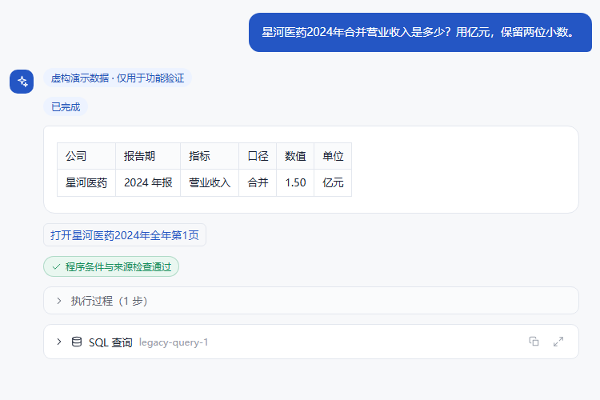
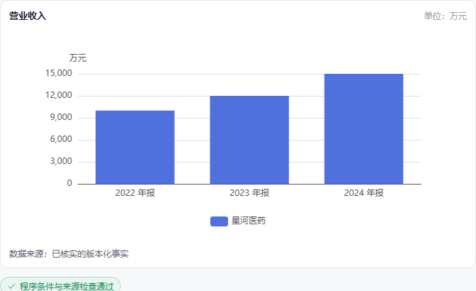

# FinSight财报证据助手

算法主题赛（AI开源）技术报告

参赛方向：开源赋能的AI应用创新

团队名称：________　团队编号：________

成员及分工：________

成果链接：[https://github.com/mzmai0658-source/FinSight](https://github.com/mzmai0658-source/FinSight)

版本日期：2026-10-02

本稿为阶段性交付材料。视频、真实用户试用、答辩PPT本阶段未开展；团队信息与实际人工审核事实待真实填写。报告不包含学校名称、学校LOGO或导师身份。

摘要：系统围绕财报学习和研究中的查数、口径比较、来源回查与连续追问，使用本地开源模型理解需求，再由程序完成财务查询、计算、证据定位与分项检查。公开复现包含五家虚构公司的十五份年报，沿用生产v3核验流程。自研成果是请求与状态协议、确定性执行、原页校验、版本发布和任务恢复，未训练或微调所用模型。最终成绩仅表示本次固定用例表现，不能推广为全市场财务问答准确率。

## 1. 场景、问题与目标

财报里相近名称可能对应不同数字：合并净利润包含少数股东损益，归母净利润只属于母公司股东，母公司净利润来自母公司单体报表，扣非归母还扣除非经常性损益。营业收入和营业总收入也不能随意互换。读者跨报告比较时还需核对期间、单位和版本。

通用对话模型能够组织语言，但不能仅凭流畅表达承担数值、口径、计算和引文真实性保证。一次回答同时包含多个数字和解释时，“其中一个数字有出处”不代表整项任务正确。连续对话里的换公司、删指标、改变年份、插话和事实代词，又会放大条件继承错误。

作品目标是把自然语言变成一份可追踪要求，让后续程序依照相同条件工作。单值查询给出简短结果；复杂需求分别说明完成和未完成部分；证据不足时诚实说明。用户可以查看来源、计算、表格和图表，而不必把模型口头自评当作验证。

公开演示为教学构造，展示安装、功能与核验。真实验证范围仍为既有十家公司、117个报告期，不扩大公司范围，不增加单季能力，不把未核实数据补零或换期填入。用户试用未开展，不宣称节省时间、提升满意度或产生学习效果。

## 2. 总体架构与实现边界

浏览器通过Vue提供登录、会话、进度、表格、图表及原页回查。Java提供鉴权、配额、归属检查、持久会话和SSE转发。Python以LangGraph运行v3 Agent，连接本地Ollama、只读MySQL与BGE/Chroma叙述索引。Java与Python的内部接口使用私有令牌。

核心链路为：本轮要求 → 紧凑结构化提案 → 条件编译与检查 → 确定性执行 → 证据审核与分项核验 → 发布与保存。

<!-- architecture -->

普通财务查询通常只让模型理解一次，数值正文由程序生成。格式或条件编译失败最多重做一次；复杂经营解释另需语言组织与证据审核。同一个小模型反复确认自己理解正确，不构成独立正确性证明。旧语义实现只供隔离历史回归，不是生产失败后的隐蔽回退。

统一请求包含目标、公司集合、指标、范围、时间、计算、否定限制、单位、小数位、图形类型、排序方向和数量，记录条件来自本轮、上下文或已说明的默认规则。精确金额以十进制字符串跨层保存，避免浮点数丢失精度。

主要算力来自RTX 4060 Laptop GPU（约8GB显存）；模型与BGE缓存可复用，本轮没有核验无缓存权重下载。运行无需商业问答API费用，但仍有本机硬件、存储、电力及首次公开下载成本，不宣称零成本。

主要自主实现包括 `src/agent/v3/`、`src/etl/canonical_projection.py`、原页证据绑定、任务与接口配套，以及验收和公开数据生成工具。LangGraph、Ollama、数据库、向量组件和前端框架属于第三方，不列为原创算法。

## 3. 事实建模与公开复现数据

每条事实绑定公司、年份、报告期、指标ID、合并/母公司范围、单位、精度、版本与来源状态。来源包含PDF内容摘要、物理页、表格行列、原始值、原始单位和单元格/表头位置。相同报告的母公司和合并数字分别保存，归母与合并净利润使用不同指标ID。

公开定义在 `demo/v3/spec.json`。五家虚构公司、三个年度，生成十五份两页PDF及240条事实；共30个物理页叙述片段。报告写明“虚构演示数据”，合并利润、资产负债、现金流、母公司利润和核心指标表分别标识范围和单位。数字与经营情节均为构造，不代表真实公司披露。

PDF、原页坐标、文件摘要、事实、叙述和兼容投影从同一定义生成。程序重新读取真实生成的PDF区域检查行名、表头、单位、位置和数值，使用与真实事实相同的 `checked_source` 门槛。修改金额、范围或原始单位的篡改测试必须失败，没有“演示数据直接放行”分支。

候选数据和索引先准备，再进行覆盖、来源、数值和投影验收，最后在数据库事务中发布兼容投影及指针。生成、索引或验收失败不切现用版本。同一任务解析一次发布指针，执行中不混入另一版本；同版本重复初始化不重复写事实和片段。

公开初始化只允许本机隔离演示库。真实117份原件、OCR与私人审核清单保留本机，提交包不包含这些文件。真实库的旧验收摘要不因代码改造而改写。

## 4. 请求理解与连续对话

模型输出紧凑提案，程序编译成正式v3请求。公司和指标限制在登记目录中；缺少明确公司且没有可用上下文时询问，缺年份默认最新年报，泛称净利润查询默认归母并注明。比较和排名默认共同报告期；逐家最新按各自报告期，明确要求优先。

对话不重新猜整份条件，而用替换、添加、删除、仅保留、沿用、清空操作修改。只换公司时保留原年份、单位和表格要求；指标替换后不继续输出旧指标；集合删除不把被删除公司重新加入。明确清空公司后，旧会话仍可读，但旧公司不再成为代词候选。

版本化状态分开保存当前条件、待澄清内容、财务任务、概念插话、执行记录及受验证事实引用。概念插话不污染财务任务；明确恢复时使用确认状态。无数据、失败或取消不把旧数字登记成新事实。

正负追问的设计是先绑定已验证事实并检查前提。最终B3仍未完成正数前提纠正，不能把这项设计写成全部问法已通过。多个候选不能任选一个。清空记忆的授权来自程序定位的本轮明确指令，模型生成的“原话”引文不能授权额外删除。

本轮干净复现发现条件动词被误识别成公司、模型混淆概念口径、记忆依据引文格式等问题，分别补足动作边界、提示约束和程序依据定位。复杂语义仍可能失败，本文不声称程序已完整理解自然语言。

## 5. 计算、展示与证据核验

SQL由程序编译并参数化，问答账号仅有SELECT；模型不自由生成写SQL、计算结果或图表点。执行器使用Decimal保留原始精度，最后展示才舍入，金额、每股指标和比例分别换算。

跨年与跨公司差额按各自比较轴计算；百分点是比例直接相减，相对变化需要除以基期。负基期说明使用绝对基期，零基期明确增长率未定义。缺失不补零、不跨期补数。排名保存方向与数量，缺失不参与数值排序，并说明查询范围；不把库内排名称为全市场排名。

图表类型、单位和显示内容来自请求；禁止画图时不生成；负数保留符号，缺失保留空点，不以单点伪造趋势。不同维度不能未经处理放在同一坐标轴。前端按需加载图表组件。

数字原文从事实登记的PDF和物理页直接定位，按原样呈现；原表单位与答案单位不同，另说明换算。经营原因检索对应公司、期间的叙述，再核对它是否支持结论；检索到真实文件但内容无关，不能证明原因。找不到证据时保留可靠数字并说明原因未确认。

核验分为数字一致性、请求满足度、证据支持度。逐目标状态依据执行和核验，不能凭任务数量相等或模型自填“完成”判通过。复杂解释中的模型审核仍可能出错，必须在验收中暴露限制。

## 6. 生命周期、取消与恢复

Java为每轮登记任务ID、客户端请求ID、会话归属、状态、截止时间及保存状态，Python持久任务独立于SSE订阅。刷新或临时断网不会取消；重新连接按任务ID查询真实状态和结果，重复提交不依问题文本猜是否已执行。

停止生成由Java核对归属后发出内部取消。Python中止可取消的模型调用，停止后续工具步骤、丢弃迟到结果并释放会话锁；只读SQL受短超时约束，取消后不得继续发布。完成、失败、取消采用单终态约束，迟到done不能覆盖取消结果。

默认模型同时执行一个任务，最多排队八个，排队超过30秒明确忙碌。整轮270秒、Python最多240秒，单次模型60秒且整轮最多六次调用，预留保存时间；预算不足保留核验部分并标记未完成。正常查数不让模型撰写数值正文。

保存失败必须显示未保存，不能把网页出现过的答案当落库成功。服务重启后明确终结遗留任务，不永久占锁。本轮首次空任务库创建曾返回404，已改为允许工作区内新文件首次创建，越界与目录仍拒绝，并补上回归测试。

真实故障验收与模拟测试分开列明。没有实测覆盖的重启/竞争条件，不因为既有代码存在就自动宣称通过。

## 7. 实验设计与最终结果

固定Qwen模型、16K上下文、temperature=0、输出上限3072、关闭可配置思考。只通过真实Java/SSE → Python Agent → Ollama → 只读数据库执行，多轮使用实际保存状态；模型摘要、代码哈希、数据/索引版本随结果记录。

20轮分为8轮经典单问、4轮易错单问和两组四轮对话，覆盖金额口径、单位、比较、排名、柱状图、概念、出处、否定、库外公司、缺证据、条件替换、插话恢复和事实指代。17/20为工程目标，不是比赛规定。本轮不重新做双模型全量对照。

首次完整尝试原始计分13/20，保留记录。评分接口纠正库外明确拒答与sign目标映射，未改变题目原文或要求；针对性调整后最终成绩必须来自同一冻结版本完整运行，不拼接成功条目。

最终结果：18/20（90%），达到17/20工程目标。经典8/8，易错3/4，对话7/8，完整四轮对话组1/2成功。耗时中位16.34秒、平均18.08秒，最长49.31秒，包含真实入口与保存。E04复合缺证据问题因条件检查失败未交付可靠部分；B3错误负数前提未完成纠正。均明确未完成、未发布错误数字。

代码与构建：独立Windows副本Python945项通过、3项私有历史资产相关测试跳过；Java69项通过；前端44项通过且类型检查/生产构建完成。锁定依赖从新虚拟环境与npm安装，Maven合法缓存复用。测试记录与逐题结果在docs/evidence，历史尝试另存，不冒充最终成绩。

真实操作及故障：真实Java/SSE取消、断连恢复、幂等、同会话冲突、保存失败与回滚、用户隔离和输入边界通过；隔离Chrome实际刷新、短断网、切换会话、历史恢复、停止按钮、移动端及PDF原页通过。取消有GPU推理→空闲及资源槽释放采样。0/14/20秒取消时序观察到取消和完成各自获胜，均仅保存一轮、终态不被迟到操作覆盖。SQL权限失败通过真实Java入口；模型不可达、数据库连接失败通过独立真实Python组件，未宣称这两项Java端到端故障已完成。坏JSON、空输出、超时、队列满与更多迟到竞争采用模拟/单元测试，不能写成全部真实服务组合均验收。

数据覆盖：公开15份报告、240条事实、30片段；真实已发布7466条事实，117份原件摘要匹配，22828片段覆盖117报告期。5287项未解决指标仍排除。本轮真实核查为只读覆盖复核，不是重新OCR或逐单元格人工审计。

## 7.1 真实页面展示

截图来自隔离演示副本与实际保存结果，桌面查询、移动端和PDF原页另有机器收据。图表点由已验证事实生成。

## 8. 相关方案、开源贡献与权利边界

FinGLM汇集财报金融问答方案，提供结构化财务数据应用的参考。TAT-LLM讨论表格与文本上的离散数值推理，启发将算术执行交给程序。ConvFinQA关注财务连续对话的数值推理，启发区分每轮事实和条件引用。这些是方法参考，未声称其思想由本作品首创，也未把其公开实验成绩当成本作品成绩。

本作品在现有组件上自主实现统一请求及逐条件修改、十进制执行、PDF事实证据绑定、分项完成判定、数据与索引发布、持久任务取消与恢复、界面证据交互和验收工具。开放成果是实际源码、公开虚构数据定义、可打开报告生成程序、接口说明和验证资产；不再分发第三方模型权重或私人财报。

Qwen上游模型卡采用Apache-2.0，BGE模型卡采用MIT。Python、Java、Node资源实际版本、来源、许可、用途、核验状态及义务见本报告附件及仓库第三方清单。PyMuPDF为AGPL-3.0或商业许可，不能误写为宽松许可；对组合应用/网络服务按上游许可履行义务或取得适当商业许可。自研文件许可不覆盖第三方权利。

开发使用AI协助设计、编码、调试、测试脚本与报告整理，合成情节由程序定义；事实数值和计算由程序核验。实际成员做过的人工代码、财务数据、AI内容审核工作、负责人和时间：________。不能将自动校验记作已完成真实人工审核。

## 9. 不足、维护与阶段性结论

本地模型可能误解多目标、跨口径或复杂否定，结构化输出和程序核验不能穷尽自由语义。未来缺报告的经营解释应诚实未完成。真实数据不完整，OCR缓存存在不等于识别正确；公开虚构测试只证明固定功能与复现条件，不能代表真实财报覆盖全部指标或全市场问答准确率。

当前限制：保留上述E04、B3两项未完成问题；支持范围以已登记公司、指标和期间为准，尚无单季能力。真实未解决5287项仍排除，旧来源有字面核对与坐标核对两种模式，未将旧模式升级成新人工审核。其他系统、无缓存下载、完整故障组合与全部自由语义未验收，未开展真实用户试用。

公开包从白名单制作并逐文件检查；环境凭据、真实PDF/OCR、私人审核清单、数据库快照、模型权重、日志、缓存与本机归档排除。包内文件清单和SHA-256用于复核；Windows干净副本重新安装运行，模型缓存复用如实记录，未宣称无缓存下载或其他系统完整联调。

维护方式为记录任务ID、版本、问题及预期，先复现再新增回归。模型或数据更换需重新验收，依赖与许可变更保留版本记录；失败候选不切指针。问题反馈渠道、负责人及维护频率待真实团队填写，不编造已建立的社区或贡献人数。

本轮完成范围是代码与公开复现、材料、验证和本地打包；后续按用户授权将可公开内容上传GitHub。视频、真实用户试用及答辩PPT未开展，团队信息与人工审核事实待补；成果链接采用上述公开GitHub仓库。满足工程交付检查后仍应称“阶段性交付完成”，不能称整套报名材料已经齐全。

参考资料（核对日期：2026-10-02）：[FinGLM](https://github.com/MetaGLM/FinGLM)、[TAT-LLM](https://github.com/fengbinzhu/TAT-LLM)、[ConvFinQA](https://github.com/czyssrs/ConvFinQA)、[Qwen模型卡](https://huggingface.co/Qwen/Qwen3.5-9B)、[BGE模型卡](https://huggingface.co/BAAI/bge-small-zh-v1.5)、[PyMuPDF许可](https://pymupdf.io/licensing)。

<!-- appendix -->

附件：第三方资源使用清单采用 docs/THIRD_PARTY.md 全文；机器可复核的传递依赖清单采用 docs/resources/。PDF构建时附入资源清单，源码保留可编辑版本。
